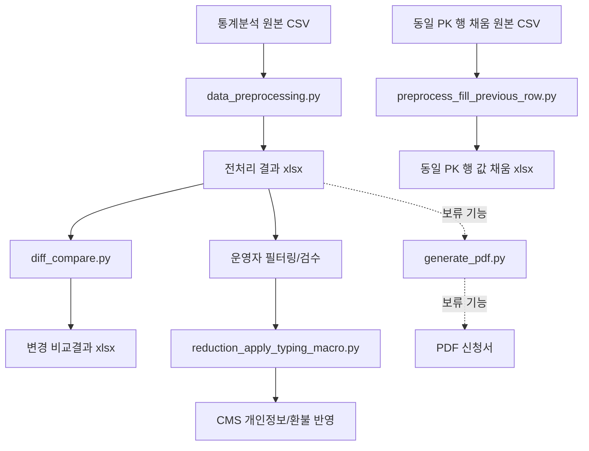

# 동작구민 감면신청서 자동화 운영 가이드 (운영 인력용)

이 문서는 **개발 지식이 없는 운영 담당자**가 실제 운영 일정에 맞춰 자동화를 사용할 수 있도록 만든 실행 매뉴얼입니다.

---

## 1) 먼저 이해해야 할 운영 원칙

이 업무는 **매일 처리하지 않습니다.**

### 운영 타이밍(핵심)
1. 예: 1~3월 기수는 전년도 12월 중순부터 접수 시작
2. 접수 시작일부터 약 1개월 경과(예: 2월 초) 시점까지 대기
3. 회원 등록이 충분히 누적된 시점에 **최초 전처리 1회** 실행
4. 이후에는 **금요일마다 부분환불이 CMS에 반영**됨
5. 전주 금요일 환불 반영이 끝났다면, 다음주 월~화에 원본 통계자료를 최신화하여 재전처리

즉, 기본 운영 리듬은
- **초기 1회 대량 전처리** +
- **주간(월/화) 업데이트 운영** 입니다.

---

## 2) 이 자동화로 처리되는 실제 업무 범위

현재 기준 자동화 업무는 아래와 같습니다.

1. 통계분석 원본 CSV를 전처리해 감면 계산 데이터 생성
2. 생성 데이터 기반 필터링(운영자 엑셀 작업)
3. 엑셀 ↔ 회원관리시스템(CMS) 왕복 입력을 매크로로 자동화
4. 이전 결과와 최신 결과 비교(추가/삭제/강좌변경/금액변경 검수)

> 참고: PDF 감면신청서 대량 생성은 **기능 개발 완료 상태**이나, 현재 운영 프로세스에서는 **보류**입니다.

---

## 3) 작업 전 준비물

### 필수 프로그램
- Windows PC
- Python 3.11 이상
- Excel
- 회원관리시스템(CMS)

### 기본 폴더
- 입력: `input/`
- 출력: `output/`
- 양식 이미지(PDF생성 모듈용): `assets/form_bg.png`

---

## 4) 최초 1회 설정

1) PowerShell 열기 후 프로젝트 폴더 이동

```powershell
cd "c:\Users\dongj\OneDrive\바탕 화면\reduction_apply_program"
```

2) 가상환경 생성

```powershell
python -m venv .venv
```

3) 가상환경 활성화

```powershell
.\.venv\Scripts\Activate.ps1
```

4) 패키지 설치

```powershell
pip install -r requirement.txt
```

---

## 5) 입력 파일 위치와 파일명 규칙(중요)

현재 스크립트는 일부 파일명을 **고정값**으로 읽습니다.

### A. 전처리 원본 CSV
- 위치: `input/data_preprocessing/`
- 파일명(고정): `제98기 일일접수세부내역(20251215-20260222).csv`

### B. 동일 PK 행 일괄 채움용 원본 CSV
- 위치: `input/preprocess_fill_previous_row/`
- 파일명(고정): `동작문화원 감면신청서_26년도 1분기_20260225.csv`

### C. PDF용 데이터(보류 기능)
- 위치: `input/generate_pdf/`
- 파일명(고정): `results_pdf.xlsx`

---

## 6) 실제 운영 절차

## 6-1. 초기 1회 전처리(등록 누적 시점)

운영 타이밍: 접수 시작 후 약 1개월 경과 + 등록 누적 충분 시점

1) 실행 준비

```powershell
cd "c:\Users\dongj\OneDrive\바탕 화면\reduction_apply_program"
.\.venv\Scripts\Activate.ps1
```

2) 전처리 실행

```powershell
python data_preprocessing.py
```

3) 결과 확인
- 생성: `output/data_preprocessing/YYYY-MM-DD_output.xlsx`
- 확인: 콘솔 `✅ 처리 완료`, 생성 행 수, 샘플 회원 데이터 정상 여부

---

## 6-2. 주간 업데이트(월~화)

운영 타이밍: 전주 금요일 환불 반영 완료 이후, 다음주 월~화

1) 최신 통계분석 원본으로 교체
2) 재전처리 실행

```powershell
python data_preprocessing.py
```

3) 변경 비교 실행

```powershell
python diff_compare.py
```

4) 비교결과 검수
- 생성: `output/diff_compare/*.xlsx`
- 구분: `추가`, `삭제`, `강좌변경(추정)`, `금액변경`

---

## 6-3. 필터링 + CMS 자동입력 연동

전처리 결과를 가지고 운영자가 엑셀에서 대상자를 필터링한 뒤, 매크로를 통해 CMS 연동 입력을 수행합니다.

운영 방식(중요):
- 매크로 입력은 **등록건 수 1 행** 기준으로 먼저 수행
- 이후 `preprocess_fill_previous_row.py`를 통해 **동일 PK(회원번호+이름) 회원의 2,3,4... 행에도** 주민번호/주소/예금주/은행/계좌번호 값을 엑셀 셀에 일괄 채움

자동 입력 대상 예시
- 주민등록번호
- 상세 주소
- 예금주
- 은행명
- 계좌번호

실행 명령:

```powershell
python reduction_apply_typing_macro.py
```

실행 절차:
1. PC 환경 선택 (`1: PC1`, `2: PC2`)
2. `F8`으로 단계별 점검(권장)
3. 문제 없으면 `F9` 자동 반복 실행
4. 종료는 `ESC`

안전 수칙:
- 실행 중 마우스/키보드 조작 금지
- Excel/CMS 창 위치를 평소와 동일하게 배치
- 해상도/배율 변경 시 오입력 가능
- 오입력 발생 시 마우스를 화면 좌측 상단으로 이동(FAILSAFE)

---

## 7) 모듈 상세 스펙 (역할/기능/입출력)

### 핵심 운영 모듈

| 모듈 | 역할 | 주요 입력 | 주요 출력 | 운영 시점 |
|---|---|---|---|---|
| `data_preprocessing.py` | 원본 접수 데이터 전처리 + 감면액 계산 + 환불 반영 | `input/data_preprocessing/*.csv`(고정 파일명 사용) | `output/data_preprocessing/YYYY-MM-DD_output.xlsx` | 초기 1회, 주간 업데이트 |
| `diff_compare.py` | 직전/최신 전처리 결과 비교 | `output/data_preprocessing` 내 최근 2개 파일 | `output/diff_compare/*_비교결과.xlsx` | 주간 업데이트 직후 |
| `preprocess_fill_previous_row.py` | 등록건 수 1 행 값을 기준으로 동일 PK(회원번호+이름) 회원의 2,3,4... 행 빈칸을 일괄 채움 | `input/preprocess_fill_previous_row/*.csv`(고정 파일명 사용) | `output/preprocess_fill_previous_row/*.xlsx` | 매크로 입력 후/필요 시 |
| `reduction_apply_typing_macro.py` | 엑셀↔CMS 간 반복 입력 자동화(좌표 기반) | 화면 좌표, 엑셀 데이터, CMS 화면 | CMS 반영 완료 상태 | 필터링 후 반영 단계 |

### 보조/개발 지원 모듈

| 모듈 | 역할 | 사용 대상 |
|---|---|---|
| `generate_pdf.py` | 감면신청서 PDF 대량 생성 기능 | 현재 운영 보류(개발/검증용) |
| `pdf_positions.py` | PDF 텍스트 좌표 정의 | 관리자/개발 담당 |
| `image_coordinate_picker.py` | PDF 배경 이미지 기준 좌표 추출 | 관리자/개발 담당 |
| `get_pos.py` | 마우스 좌표 저장(매크로 좌표 보정 지원) | 관리자/개발 담당 |

---

## 8) 모듈 연결 흐름 (시각화)



---

## 9) 운영 체크리스트 (주간 기준)

- [ ] 전주 금요일 환불 반영이 완료되었는가?
- [ ] 월~화에 최신 원본 CSV로 교체했는가?
- [ ] `data_preprocessing.py` 재실행 후 행 수/샘플 데이터 점검했는가?
- [ ] `diff_compare.py` 결과에서 비정상 변경(오탐)을 검토했는가?
- [ ] 필터링 대상만 매크로로 CMS 반영했는가?
- [ ] 산출물(`output`) 백업했는가?

---

## 10) 자주 발생하는 오류와 해결

### 오류 1) `입력 파일이 존재하지 않습니다`
- 원인: 경로 또는 파일명 불일치
- 해결: 5번 항목의 고정 파일명/경로 확인 후 재실행

### 오류 2) `필수 컬럼이 누락되었습니다`
- 원인: 원본 CSV 컬럼명 변경/오탈자/공백
- 해결: 표준 컬럼명으로 정리 후 재실행

### 오류 3) 매크로 오클릭/오입력
- 원인: 해상도/창 위치/배율 변경, 포커스 창 변경
- 해결: 창 재정렬 후 `F8` 디버그로 단계 점검 뒤 `F9` 실행

### 오류 4) 비교결과가 예상과 다름
- 원인: 최신 원본 교체 누락, 이전 파일 선택 착오
- 해결: `output/data_preprocessing` 최신 2개 파일 날짜 확인 후 다시 비교

---

## 11) 권장 업무 분장

- 운영 담당자: 원본 수집, 실행, 필터링, 1차 검수, CMS 반영
- 관리자/개발 담당: 파일명 규칙 변경, 좌표 보정, 로직 수정, 장애 대응

---

## 12) 현재 상태 요약

- 운영 핵심: 전처리 + 비교검수 + 필터링 + 매크로 CMS 반영
- PDF 일괄 생성: **개발 완료 / 운영 보류**
